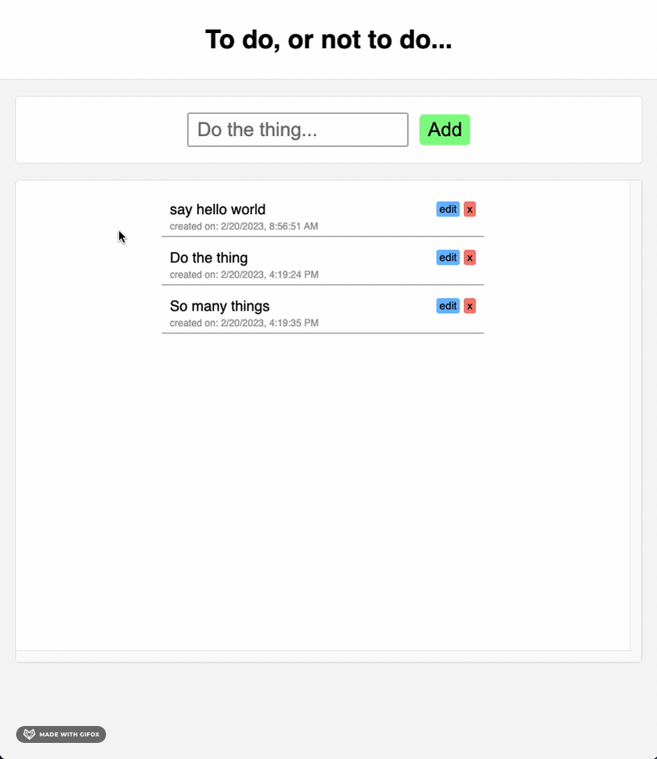
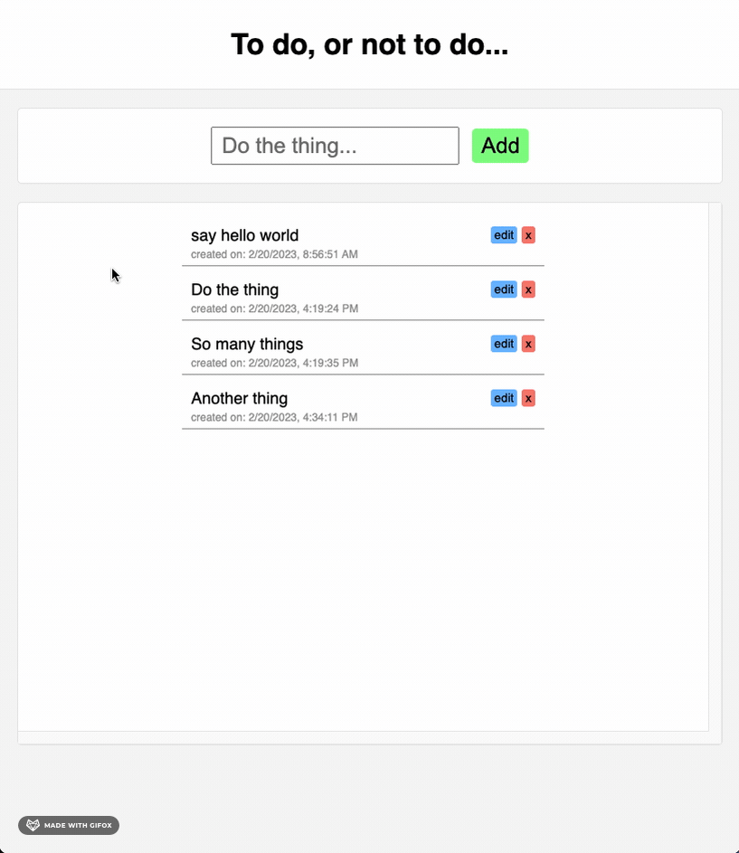
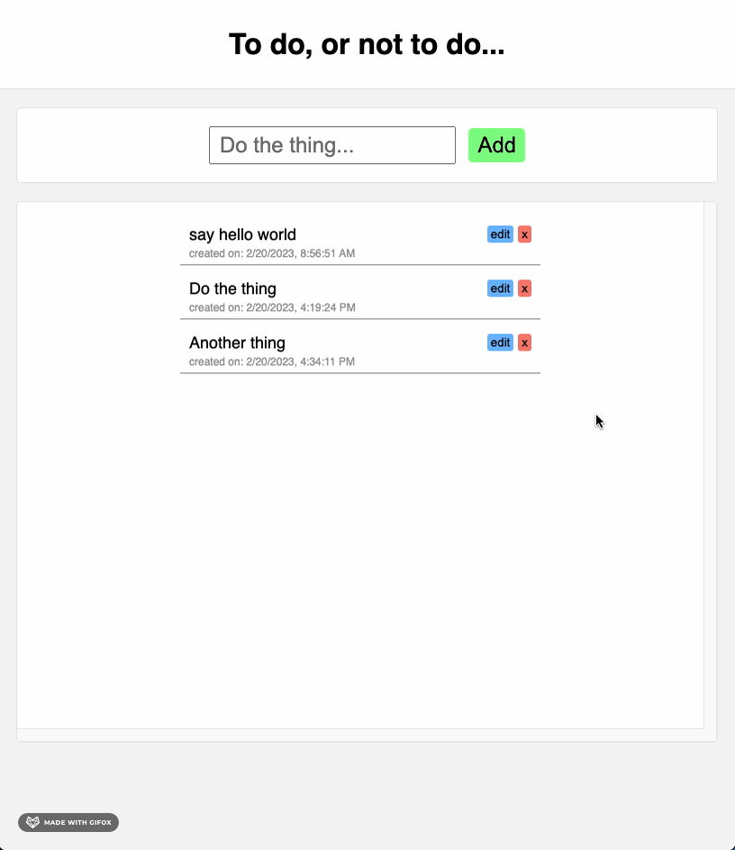

# To-Do

A to-do app created in vanilla HTML/CSS/JS with an Express.js/Postgres back end.

# Demo

## Add a todo!



## Delete a todo!



## Edit a todo!



# Where is it?

This app is currently not hosted anywhere...

# Setup

However, this app is ready to be easily configured for a live server! The client and server code is included.

All you need to do is:

- Insert your domain name at the top of the client/index.js file (for the fetch API calls).
- Create a table in your data base with this command:

  ```
  CREATE TABLE todos (
    todo_id serial PRIMARY KEY,
    description VARCHAR ( 150 ) NOT NULL,
    created_on TIMESTAMP,
    was_edited BOOLEAN DEFAULT 'false'
  );
  ```

* Update the server/db.js file with your database info.
